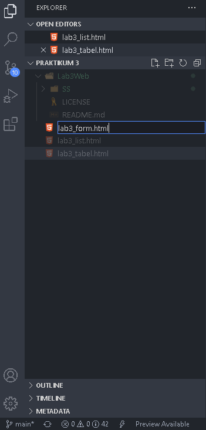

<p align="center">
	PEMROGRAMAN WEB
</p>
<p align="center">
	TUGAS PRATIKUM 3
</p>
<p align="center">
	Dosen Pengampu : Agung Nugroho, M.Kom
</p>
<p align="center"> 
	<b>Tugas untuk memenuhi syarat penilain pada Pert-3</b>
</p>

<p align="center">
	
</p>

<p align="center">
                 Nama  : Jose Fisto
</p>
<p align="center">
                 NIM   : 312010119
</p>
<p align="center">
                 Kelas : TI.20 A.1
</p>

<br/>
<br/>

<p align="center">
	<b>UNIVERSITAS PELITA BANGSA</b>
</p>
<p align="center">
	<b>FAKULTAS TEKNIK</b>
</p>
<p align="center">
	<b>TEKNIK INFORMATIKA</b>
</p>
<p align="center">
	<b>TA 2021 / 2022</b>
</p>

<br></br>

<hr>
</hr>

<br></br>

# Laporan Praktikum 3

## 1. Buka Aplikasi / Software Editor
Software editor yang saya gunakan ialah Visual Studio Code

<p align="center">
	
</p>
<p align="center">
	Gambar Visual Studio Code (1.1)
</p>

## 2. Buat Folder
Selanjutnya buat folder dengan nama ``Lab3Web``

<p align="center">
	
</p>
<p align="center">
	Gambar Buat Folder (2.1)
</p>

## 3. Alokasikan folder pada tampilan workspace VS Code
Selanjutnya tampilkan folder yang baru dibuat sebelumnya untuk menampilkan pada kolom workspace Vs Code

<p align="center">
	
</p>
<p align="center">
	Gambar Alokasi Folder (3.1)
</p>

## 4. Buat file baru
Selanjutnya buat file dan beri nama ``lab3_list.html``

<p align="center">
	
</p>
<p align="center">
	Gambar Buat File Baru (4.1)
</p>

Kemudian buat dokumen html sebagai berikut

```html
<!DOCTYPE html>
<html lang="en">
<head>
    <meta charset="UTF-8">
    <meta name="viewport" content="width=device-width, initial-scale=1.0">
    <title>HTML Lanjutan</title>
</head>
<body>
    <header>
        <h1>Membuat List</h1>
    </header>
</body>
</html>
```

## 5. Membuat List HTML

### Ordered List
Selanjutnya tambahkan <i>Ordered list</i> dengan kode sebagai berikut

```html
<section id="order-list">
    <h2>Ordered List</h2>
        <ol>
            <li>Pemrograman Web</li>
            <li>Sistem Informasi</li>
            <li>Basis Data 2</li>
        </ol>
</section>
```
Hasil Output atau setelah di jalankan

<p align="center">
	
</p>
<p align="center">
	Gambar Ordered List (5.1)
</p>

Pada list di atas merupakan list yang berurutan atau <i>Ordered List</i>, yang biasanya banyak di gunakan untuk membuat langkah - langkah.

### Unordered List
Selanjutnya tambahkan <i>Unordered List</i> setelah <i>Ordered list</i> dengan kode sebagai berikut

```html
<section id="unorder-list">
    <h2>Unordered List</h2>
        <ul type="square">
            <li>Jaringan Komputer</li>
            <li>Struktur Data</li>
            <li>Algoritma &amp; Pemrograman</li>
        </ul>
   </section>   
```

Hasil Output atau setelah di jalankan

<p align="center">
	
</p>
<p align="center">
	Gambar Unordered List (5.2)
</p>

Pada list di atas merupakan list tidak berurutan atau <i>Unordered List</i>, biasanya banyak di gunakan untuk membuat daftar isi.

### Description List
Selanjutnya tambahkan <i>Description List</i>, Setelah <i>Unordered List</i> dengan kode sebagai berikut

```html
<section id="unorder-list">
    <h2>Description List</h2>
        <dl>
            <dt>Fakultas Teknik</dt>
            <dd>Teknik Industri</dd>
            <dd>Teknik Informatika</dd>
            <dd>Teknik Lingkungan</dd>
            <dt>Fakultas Ekonomi dan Bisnis</dt>
            <dd>Akuntansi</dd>
            <dd>Manajemen</dd>
            <dd>Bisnis Digital</dd>
        </dl>
   </section>
```

Hasil Output atau setelah di jalankan

<p align="center">
	
</p>
<p align="center">
	Gambar Description List (5.3)
</p>

Pada list di atas merupakan list menampilkan definisi atau <i>Description List</i>, biasanya untuk menampilkan keterangan ataupun jenis - jenis.

## 6. Membuat Tabel HTML
Buat dokumen html baru dengan nama ```lab3_tabel.html```

<p align="center">
	
</p>
<p align="center">
	Gambar File Tabel HTML (6.1)
</p>

Kemudian buat dokumen html dengan contoh kode sebagai berikut

```html
<!DOCTYPE html>
<html lang="en">
<head>
 <meta charset="UTF-8">
 <meta name="viewport" content="width=device-width, initial-scale=1.0">
 <title>HTML Lanjutan</title>
</head>
<body>
    <header>
        <h1>Membuat Table</h1>
    </header>
</body>
</html>
```
### Tabel Sederhana
Selanjutnya tambahkan kode sebagai berikut untuk membuat tabel sederhana

```html
<table border="1">
            <thead>
                <tr>
                    <th>No.</th>
                    <th>Fakultas</th>
                    <th>Program Studi</th>
                </tr>
            </thead>
            <tbody>
                <tr>
                    <td>1.</td>
                    <td>Teknik</td>
                    <td>Teknik Informatika</td>
                </tr>
                <tr>
                    <td>2.</td>
                    <td>Teknik</td>
                    <td>Teknik Industri</td>
                </tr>
                <tr>
                    <td>3.</td>
                    <td>Teknik</td>
                    <td>Teknik Lingkungan</td>
                </tr>
            </tbody>
        </table>
```

Hasil Output atau setelah di jalankan

<p align="center">
	
</p>
<p align="center">
	Gambar Tabel HTML Sederhana (6.2)
</p>

Pada kode pembuatan tabel di atas memiliki 7 Elemen dan 1 atribut Style, antaranya :
- ``<table>..</table>``, untuk menampilkan data terstruktur
- ``<thead>..</thead>``, untuk menampilkan konten / data table  awal pada bagan kepala
- ``<tr>..</tr>``      , untuk membuat baris pada table
- ``<th>..</th>``      , untuk mendeskripsikan header di dalam tabel
- ``<tbody>..</tbody>``, untuk mengemas konten bagian isi tabel
- ``<td>..</td>``      , untuk membuat kolom dan disisipkannya data
- ``border="1"``       , untuk menghasilkan garis tepi pada tabel

#### Mengatur Garis Tepi pada Tabel
Menyisipkan style margin dan padding pada elemen ``<table>..</table>`` untuk mengatur garis tepi tabel

```css
<table border="1" cellpadding="4" cellspacing="0">
```

Hasil Output atau setelah di jalankan

<p align="center">
	
</p>
<p align="center">
	Gambar Mengatur Garis Tepi Tabel HTML (6.3)
</p>

### Menggabungkan Sel Data

Selanjutnya menggabungkan sel data dengan menyisipkan atribut rowspan dan colspan dalam sel data

#### Atribut Rowspan

Menyisipkan atribut rowspan berikut kode contoh sebagai berikut

```html
    <table border="1" cellpadding="6" cellspacing="0">
        <thead>
            <tr>
                <th>No.</th>
                <th>Fakultas</th>
                <th>Program Studi</th>
            </tr>
        </thead>
        <tbody>
            <tr>
                <td>1.</td>
                <td rowspan="3">Teknik</td>
                <td>Teknik Informatika</td>
            </tr>
            <tr>
                <td>2.</td>
                <td>Teknik Industri</td>
            </tr>
            <tr>
                <td>3.</td>
                <td>Teknik Lingkungan</td>
            </tr>
        </tbody>
    </table>
```

Hasil Output atau setelah di jalankan

<p align="center">
	
</p>
<p align="center">
	Gambar Atrribut Rowspan (6.4)
</p>

Attribut Rowspan pada cell data berfungsi untuk membuat sel tabel menyatu secara Vertikal (atas ke bawah)

#### Atribut Colspan

Menyisipkan atribut Colspan berikut kode contoh sebagai berikut

```html
<table border="1" cellpadding="6" cellspacing="0">
        <thead>
            <tr>
                <th>No.</th>
                <th>Fakultas</th>
                <th>Program Studi</th>
                <th>Tahun Ajaran</th>
            </tr>
        </thead>
        <tbody>
            <tr>
                <td>1.</td>
                <td>Teknik</td>
                <td colspan="2">Teknik Informatika, 2020 / 2021</td>
                </tr>
            <tr>
                <td>2.</td>
                <td>Teknik</td>
                <td colspan="2">Teknik Industri, 2021 / 2022</td>
                </tr>
            <tr>
                <td>3.</td>
                <td>Teknik</td>
                <td colspan="2">Teknik Lingkungan, 2022 / 2023</td>
            </tr>
        </tbody>
    </table>
```

Hasil Output atau setelah di jalankan

<p align="center">
	
</p>
<p align="center">
	Gambar Atrribut Colspan (6.5)
</p>

Attribut Colspan pada cell data berfungsi untuk membuat sel tabel menyatu secara Horizontal (kiri ke kanan)

## 7. Membuat Form
Selanjutnya buat file dokumen html dengan format nama ``lab3_form.html``

<p align="center">
	
</p>
<p align="center">
	Gambar File Form (7.1)
</p>

Kemudian berikan kode stuktur html dasar dengan contoh sebagai berikut

```html
<!DOCTYPE html>
<html lang="en">
<head>
    <meta charset="UTF-8">
    <meta name="viewport" content="width=device-width, initial-scale=1.0">
    <title>HTML Lanjutan</title>
</head>
<body>
    <header>
        <h1>Membuat Form</h1>
    </header>
</body>
</html>
```

### Form

Membuat tabel sederhana untuk pembuatan form dengan contoh code sebagai berikut :
```html
    <form action="proses.php" method="post">
        <fieldset>
        <legend>Data Pelanggan</legend>
            <p>
                <label for="nama">Nama</label>
                <input type="text" id="nama" name="nama">
            </p>
            <p>
                <label for="alamat">Alamat</label>
                <textarea id="alamat" name="alamat" cols="20" rows="3"></textarea>
            </p>
            <p>
                <label>Jenis Kelamin</label>
                <input id="jk_l" type="radio" name="kelamin" value="L" />
                    <label for="jk_l">Laki-laki</label>
                <input id="jk_p" type="radio" name="kelamin" value="P" />
                    <label for="jk_p">Perempuan</label>
            </p>
            <p><input type="submit" value="Login"></p>
        </fieldset>
    </form>
```

Hasil Output atau setelah di jalankan

<p align="center">
	
</p>
<p align="center">
	Gambar Form Tabel (7.2)
</p>

Pada kode pembuatan form di atas terdapat 5 elemen :
- ``<fieldset>..</fieldshet>``, digunakan untuk mengelompokkan data dalam daftar input pada tab form.
- ``<legend>..</legend>``, berfungsi untuk memberi judul pada tab form
- ``<label>..</label>``, berfungsi untuk menyeleksi pilihan pada tab form
- ``<input>..</input>``, berfungsi untuk meninputkan (masukkan) data secara manual secara bebas (diedit/diketik)
- ``<textarea>..</textarea>``, fungsi sama dengan elemen input namun elemen textarea bisa menampung lebih dari 1 baris setiap penulisan, sedangkan input terbatas 1 baris setiap masukkan text.

## 8. Menyisipkan Style pada tab Form
Selanjutnya menambahkan style pada form untuk memperindah atau memberikan tampilan baru pada tab form

Sisipkan kode berikut dalam tag elemen ``<head>..</head>``

```html
<style>
    form p > label {
    display: inline-block;
    width: 100px;
    }
    form input[type="text"], form textarea {
    border: 1px solid #197a43;
    }
    form input[type="submit"] {
    border: 1px solid #197a43;
    background-color: #197a43;
    color: #ffffff;
    font-weight: bold;
    padding: 5px 15px;
    }
   </style>
```

Hasil Output atau setelah di jalankan

<p align="center">
	
</p>
<p align="center">
	Gambar Style Form (8.1)
</p>

## 9. Pertanyaan dan Tugas
Pertanyaan dan Tugas
1. Buatlah form yang menampilkan <b><i>dropdown</b></i> menu dan <b><i>listbox</b></i> dengan multiple selection.

### Jawaban :

#### Membuat Dropdown Menu
Pertama buat file dokumen html baru dengan format ``lab3_form_dropdown_menu.html``

<p align="center">
	
</p>
<p align="center">
	Gambar File Dropdown Menu (9.1)
</p>

Kemudian input kode di bawah pada file tersebut atau bisa ambil mentahan pada file dokumen html ``lab3_form.html``

```html
<!DOCTYPE html>
<html lang="en">
<head>
 <meta charset="UTF-8">
 <meta name="viewport" content="width=device-width, initial-scale=1.0">
 <title>Form Dropdown Menu</title>
</Head>  
<Body>   
    <header>
        <h1>
            Dropdown Menu Tabel Form
        </h1>
    </header>
    <form>  
        <fieldset>
            <legend>Data Pelanggan</legend>
                <p>
                    <label for="nama">Nama</label>
                    <input type="text" id="nama" name="nama">
                </p>
                <p>
                    <label for="alamat">Alamat</label>
                    <textarea id="alamat" name="alamat" cols="20" rows="3"></textarea>
                </p>
                <p>
                    <label>Jenis Kelamin</label>
                    <input id="jk_l" type="radio" name="kelamin" value="L" />
                        <label for="jk_l">Laki-laki</label>
                    <input id="jk_p" type="radio" name="kelamin" value="P" />
                        <label for="jk_p">Perempuan</label>
                </p>
            </fieldset>  
    </form>  
</Body>
</Html>
```

Selanjutnya teman - teman isikan lagi kode pada di bawah berikut ini untuk membuat Dropdown Menu dan letakkan kode tersebut sebelum ``</fieldset>``

```html
<label>Provinsi</label>  
        <select>
            <option align="center" value="" disabled selected hidden>--Pilih--</option>  
            <option value = "Jawa Barat">Jawa Barat</option>  
            <option value = "Jawa Timur">Jawa Timur</option>  
            <option value = "Kalimantan Timur">Kalimantan Timur</option>  
            <option value = "Bali">Bali</option>  
        </select>
```

Selanjutnya run / hasilkan output

<p align="center">
	
</p>
<p align="center">
	Gambar Output Dropdown Menu (9.2)
</p>

### Membuat Listbox dengan Multiple Selection

Buat file baru dokumen html dengan format ``form_listbox_multiple_selection.html``

<p align="center">
	
</p>
<p align="center">
	Gambar File Listbox Mutiple Selection(9.3)
</p>

Kemudian input kode di bawah pada file tersebut atau bisa lanjutkan dengan file dokumen html sebelumnya ``lab3_form_dropdown_menu.html``

```html
<!DOCTYPE html>
<html lang="en">
<head>
 <meta charset="UTF-8">
 <meta name="viewport" content="width=device-width, initial-scale=1.0">
 <title>Form Dropdown Menu</title>
</Head>  
<Body>   
    <header>
        <h1>
            Dropdown Menu Tabel Form
        </h1>
    </header>
    <form>  
        <fieldset>
            <legend>Data Pelanggan</legend>
                <p>
                    <label for="nama">Nama</label>
                    <input type="text" id="nama" name="nama">
                </p>
                <p>
                    <label for="alamat">Alamat</label>
                    <textarea id="alamat" name="alamat" cols="20" rows="3"></textarea>
                </p>
                <p>
                    <label>Jenis Kelamin</label>
                    <input id="jk_l" type="radio" name="kelamin" value="L" />
                        <label for="jk_l">Laki-laki</label>
                    <input id="jk_p" type="radio" name="kelamin" value="P" />
                        <label for="jk_p">Perempuan</label>
                </p>
                <label>Provinsi</label>  
                    <select>
                        <option align="center" value="" disabled selected hidden>--Pilih--</option>  
                        <option value = "Jawa Barat">Jawa Barat</option>  
                        <option value = "Jawa Timur">Jawa Timur</option>  
                        <option value = "Kalimantan Timur">Kalimantan Timur</option>  
                        <option value = "Bali">Bali</option>  
                    </select>
                <p><input type="submit" value="Login"></p>
            </fieldset>  
    </form>  
</Body>
</Html>
```

Sama seperti sebelumnya isikan kembali kode di bawah ini sebelum tag elemen ``</fieldset>`` untuk membuat Listbox Mutiple Selection

```html
                    <label>Pengguna Kartu Sim</label>
                    <div class="multipleSelection">
                        <div class="selectBox" 
                            onclick="showCheckboxes()">
                            <select>
                                <option>--Kartu Sim--</option>
                            </select>
                            <div class="overSelect"></div>
                        </div>
                        <div id="checkBoxes">
                            <label for="telkomsel">
                                <input type="checkbox" id="telkomsel" />
                                Telkomsel
                            </label>
                              
                            <label for="xl">
                                <input type="checkbox" id="xl" />
                                XL
                            </label>
                            <label for="indosat">
                                <input type="checkbox" id="indosat" />
                                Indosat-Ooredo
                            </label>
                            <label for="smartfren">
                                <input type="checkbox" id="smartfren" />
                                Smartfren
                            </label>
                        </div>
                    </div>
```

Kemudian tambahkan lagi style CSS Internal pada tag elemen ``<head>`` untuk merapikan tampilan Listbox secara vertikal

```css
<style>
    .multipleSelection {
        width: 300px;
        background-color: #BCC2C1;
    }
    .selectBox {
        position: relative;
    }
    .selectBox select {
        width: 100%;
        font-weight: bold;
    }
    .overSelect {
        position: absolute;
        left: 0;
        right: 0;
        top: 0;
        bottom: 0;
    }
    #checkBoxes {
        display: none;
        border: 1px #8DF5E4 solid;
    }
    #checkBoxes label {
        display: block;
    }
    #checkBoxes label:hover {
        background-color: #4F615E;
    }
</style>
```

Dan terakhir tambahkan kode JavaScript sesudah kode ``</form>``  berfungsi untuk mendukung atribut checkbox

```javascript
    <script>
        var show = true;
        function showCheckboxes() {
            var checkboxes = 
                document.getElementById("checkBoxes");
            if (show) {
                checkboxes.style.display = "block";
                show = false;
            } else {
                checkboxes.style.display = "none";
                show = true;
            }
        }
    </script> 
```

Dan selanjutnya run / hasilkan output

<p align="center">
	
</p>
<p align="center">
	Gambar Listbox Mutiple Selection(9.4)
</p>

Sekian semoga ilmu tersebut bisa bermanfaat bagi teman - teman, selamat mengerjakan